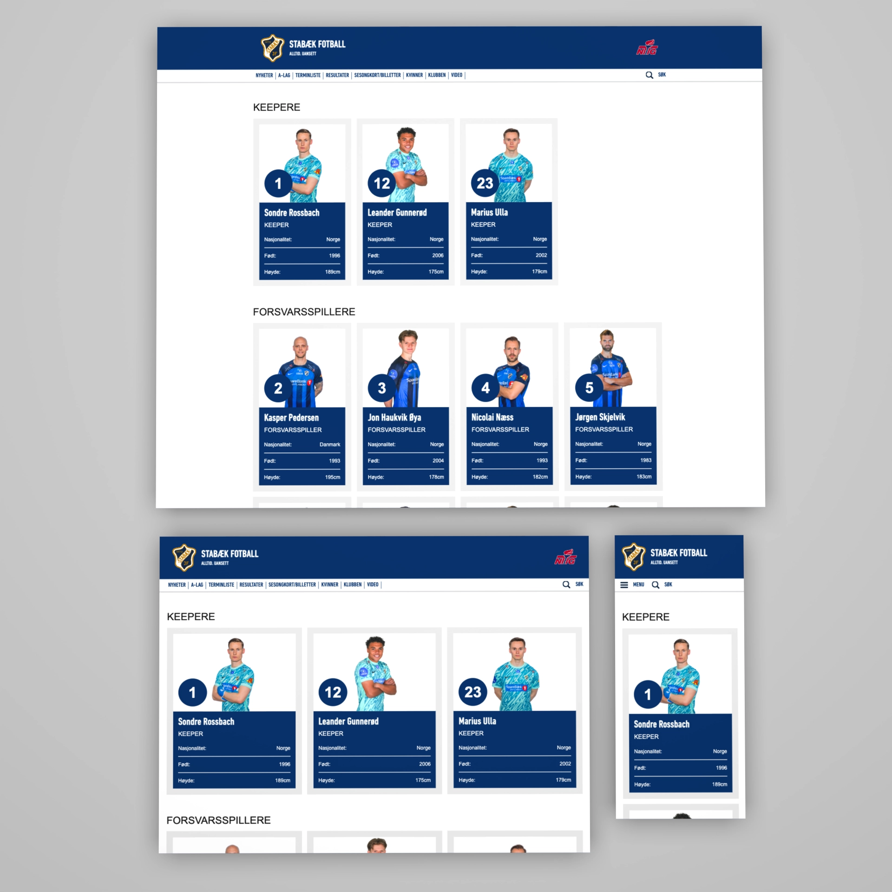

## Stabæk football - Design clone

This project is a student assignment for Høyskolen Kristiania, replicating the design of the [Stabæk fotball team page](https://www.stabak.no/lag). It features a fully responsive design for both desktop and mobile, created using vanilla HTML and CSS.

**Published website:** https://stabak-football-clone.vercel.app/



## Features

- **Responsive Design:** Optimized for both desktop and mobile devices.
- **Lightweight:** Built using vanilla HTML and CSS for simplicity and performance.

## Installation

1. Clone the repository:

```bash
git clone https://github.com/sbraende/stabak-football-clone
```

2. Navigate into the source directory:

```bash
cd stabak-football-clone/src
```

Github repository: https://github.com/sbraende/stabak-football-clone
Published webpage: https://stabak-football-clone.vercel.app/
